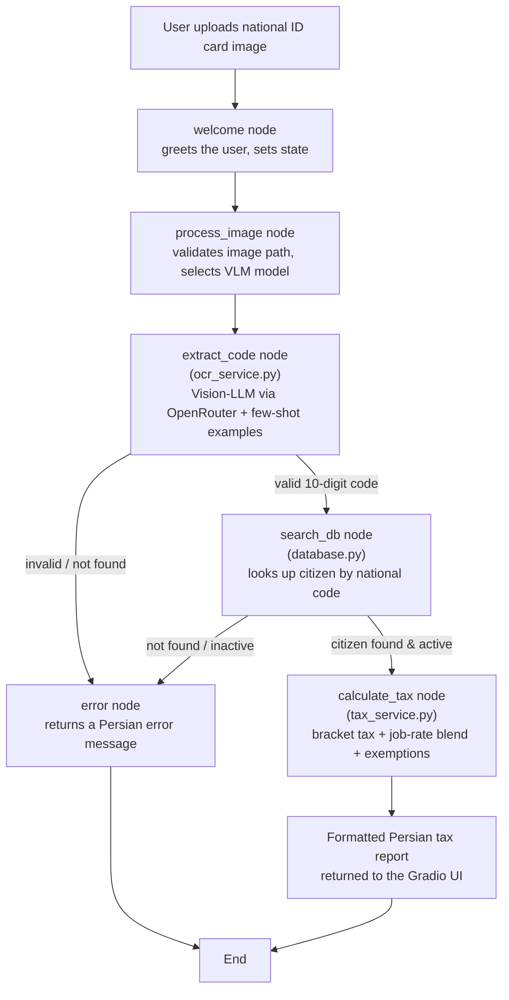
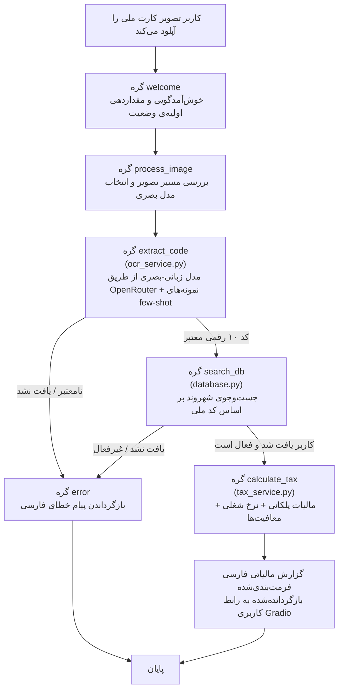

# Tax Calculation System 

An AI-powered demo application that reads an Iranian national ID card image, extracts the national code via a vision-language model, looks up the citizen's tax profile in a local database, and computes their annual income tax — all through a **LangGraph** workflow with a **Gradio** web interface.

---

##  Overall Pipeline

The core of the app is a `LangGraph` state machine (`graph.py`) that moves a request through five sequential nodes, routing to an error node whenever a step fails:



**Pipeline stages, in words:**
1. **Welcome** — initializes the LangGraph state for the request.
2. **Process image** — confirms an image was actually uploaded and records which vision model to use.
3. **Extract national code (OCR)** — sends the ID card image to a vision-capable LLM (through OpenRouter, via LangChain's `ChatOpenAI` wrapper) together with a system prompt and several **few-shot image/answer examples**, then parses out a clean 10-digit code and validates it with Iran's national-code checksum algorithm.
4. **Search database** — looks up the extracted national code in a local SQLite database (citizens, cities, provinces, job categories) and confirms the account is active.
5. **Calculate tax** — applies a progressive tax-bracket schedule blended with a job-specific flat rate, subtracts any active exemptions (disability, veteran status, head-of-household, multiple children, etc.), stores the resulting record, and formats a full Persian-language tax report.
6. **Error handling** — any failure along the way (no image, unreadable/invalid code, citizen not found, inactive account) is routed to a dedicated error node that returns a clear Persian message instead of crashing.

---

## How the Demo Works

The Gradio interface (`app.py`) exposes four tabs:

1. ** Calculate Tax** — upload a photo of an Iranian national ID card and click **"محاسبه مالیات" (Calculate Tax)**. The image is sent through the LangGraph pipeline above; the resulting Persian tax report (personal info, base tax, applied exemptions, and final payable amount) is displayed in a monospaced, right-to-left textbox.
2. ** Search User** — enter a 10-digit national code directly (no image needed) to look up a citizen's profile and full tax-payment history from the database. Five sample national codes are listed in the UI for quick testing.
3. ** Guide** — in-app instructions (in Persian) covering how to get an OpenRouter API key, how to run a calculation, the supported vision models, and how the tax formula works.
4. ** About** — describes the tech stack and the database schema.

Under the hood, `ocr_service.py` builds a prompt with several **labeled example ID-card images** so the vision model reliably returns only a bare 10-digit number (or `NOT_FOUND`), which is then checksum-validated before ever touching the database.

---

##  Features

-  **AI-powered ID card OCR** — extracts the national code from a photographed ID card using any OpenRouter vision-capable model (GPT-4o, GPT-4o Mini, GPT-4 Turbo, Claude 3.5 Sonnet, Claude 3 Opus, Gemini Pro Vision, Gemini 1.5 Pro, Llama 3.2 90B Vision).
-  **Few-shot prompting for reliability** — several example ID-card images with known-correct answers are included in every OCR request to keep the model's output format consistent.
-  **Iranian national-code checksum validation** — rejects malformed or clearly fake codes (e.g. all-repeated digits) before any database lookup, using the official check-digit algorithm.
-  **LangGraph-orchestrated workflow** — a clear, inspectable state machine with dedicated nodes and conditional routing, rather than one large monolithic function.
-  **Relational tax database (SQLite)** — provinces, cities, job categories with per-job tax rates, citizens, historical tax records, and time-bound exemptions, auto-created and seeded on first run.
-  **Progressive bracket + job-rate tax formula** — combines a five-bracket progressive schedule with a job-specific flat rate (averaged), then layers on percentage-based exemptions (capped at 100%).
-  **Citizen lookup & tax history** — search by national code to see personal details and every past year's tax record with its payment status.
-  **Full Persian (RTL) UI** — Gradio interface styled for right-to-left Persian text throughout, with a dark/light "Soft" theme.
-  **Formatted human-readable reports** — box-drawing-styled Persian reports summarizing personal info, applied exemptions, and the final payable tax.

---

##  Requirements

- Python 3.10+
- An [OpenRouter](https://openrouter.ai) API key (for the vision-model OCR step)
- Key dependencies (install via `requirements.txt` — add these if not already listed):
  - `gradio` — web UI
  - `langgraph`, `langchain-core`, `langchain-openai` — workflow orchestration and LLM access
  - `httpx` — direct HTTP fallback path to OpenRouter
  - `python-dotenv` — loads `OPENROUTER_API_KEY` from a `.env` file
  - `sqlite3` (Python standard library — no install needed)

> **Note:** The bundled `tax_system.db` SQLite file is created and seeded automatically on first run if it doesn't already contain data (`init_database()` / `seed_database()` run at import time in `database.py`). The `few_shot_examples/` folder referenced by `ocr_service.py` must contain the sample ID-card images (`sample_01` … `sample_06`) for the few-shot prompting to work; if it's missing, OCR still runs but without the accuracy boost from the examples.

---

##  Installation & Usage

```bash
# 1. Clone the repository
git clone <your-repo-url>
cd <your-repo-folder>

# 2. Create and activate a virtual environment (recommended)
python -m venv venv
source venv/bin/activate      # On Windows: venv\Scripts\activate

# 3. Install dependencies
pip install -r requirements.txt

# 4. Configure your OpenRouter API key
echo "OPENROUTER_API_KEY=your-api-key-here" > .env

# 5. Run the app
python app.py
```

The app launches a Gradio server at `http://0.0.0.0:1689` (see the `demo.launch(...)` call at the bottom of `app.py`).

### Sample national codes for testing (from the seeded database)

| National code | Name | Job |
|---|---|---|
| `1270765108`* | علی محمدی (Ali Mohammadi) | Government employee |
| `0023456789` | مریم احمدی (Maryam Ahmadi) | Physician |
| `0034567890` | محمد رضایی (Mohammad Rezaei) | Engineer |
| `0045678901` | زهرا حسینی (Zahra Hosseini) | Retired |
| `0056789012` | امیر کریمی (Amir Karimi) | Self-employed |

\* Note: the seed data in `database.py` inserts this citizen with code `1270765108`, while the in-app "Guide" and "Search" tabs list the sample as `0012345678` — double-check against your actual seeded database if a lookup doesn't return a result.

---

## Project Structure

```
.
├── app.py              # Gradio UI: tabs for calculation, search, guide, and about
├── graph.py             # LangGraph state machine orchestrating the tax-calculation flow
├── ocr_service.py        # Vision-LLM OCR (OpenRouter) + few-shot examples + code validation
├── database.py           # SQLite schema, seed data, and query helpers
├── tax_service.py        # Tax-bracket calculation, exemptions, and report formatting
├── tax_system.db         # SQLite database file (auto-created/seeded on first run)
├── few_shot_examples/    # Sample ID-card images used to prompt the OCR model (not included here — add your own)
└── README.md
```

---

---

# سیستم محاسبه مالیات

یک اپلیکیشن دموی مبتنی بر هوش مصنوعی که تصویر کارت ملی ایرانی را می‌خواند، کد ملی را با استفاده از یک مدل زبانی-بصری استخراج می‌کند، پروفایل مالیاتی شهروند را در یک پایگاه داده‌ی محلی جست‌وجو کرده و مالیات سالانه‌اش را محاسبه می‌کند — همه‌ی این‌ها از طریق یک گردش‌کار **LangGraph** با رابط کاربری وب **Gradio**.

---

## نمای کلی پایپ‌لاین

هسته‌ی اصلی اپلیکیشن یک ماشین‌حالت `LangGraph` (در فایل `graph.py`) است که یک درخواست را از میان پنج گره‌ی پیاپی عبور می‌دهد و در صورت شکست هر مرحله، آن را به گره‌ی خطا هدایت می‌کند:



**مراحل پایپ‌لاین به‌صورت متنی:**
۱. **خوش‌آمدگویی (Welcome)** — وضعیت اولیه‌ی LangGraph را برای درخواست مقداردهی می‌کند.

۲. **پردازش تصویر (Process image)** — بررسی می‌کند که آیا واقعاً تصویری آپلود شده و مدل بصری مورد استفاده را ثبت می‌کند.

۳. **استخراج کد ملی (OCR)** — تصویر کارت ملی را همراه با یک پرامپت سیستمی و چندین **نمونه‌ی تصویر/پاسخ به سبک few-shot** به یک مدل زبانی دارای قابلیت بینایی (از طریق OpenRouter و با استفاده از رَپر `ChatOpenAI` کتابخانه‌ی LangChain) ارسال می‌کند، سپس یک کد ۱۰ رقمی تمیز را استخراج کرده و با الگوریتم رقم کنترلی کد ملی ایران آن را اعتبارسنجی می‌کند.

۴. **جست‌وجو در پایگاه داده (Search database)** — کد ملی استخراج‌شده را در یک پایگاه داده‌ی SQLite محلی (شهروندان، شهرها، استان‌ها، دسته‌بندی مشاغل) جست‌وجو کرده و فعال بودن حساب را بررسی می‌کند.

۵. **محاسبه‌ی مالیات (Calculate tax)** — یک جدول مالیات پلکانی تصاعدی را با نرخ ثابت مخصوص شغل ترکیب می‌کند، هرگونه معافیت فعال (معلولیت، ایثارگری، سرپرست خانوار، چند فرزندی و غیره) را کسر می‌کند، رکورد نهایی را ذخیره کرده و یک گزارش کامل مالیاتی به زبان فارسی فرمت‌بندی می‌کند.

۶. **مدیریت خطا** — هر خطایی در طول مسیر (بدون تصویر، کد نامعتبر یا غیرقابل‌خواندن، کاربر یافت‌نشده، حساب غیرفعال) به یک گره‌ی خطای اختصاصی هدایت می‌شود که به‌جای کرش کردن برنامه، یک پیام واضح فارسی برمی‌گرداند.

---

## نحوه‌ی کارکرد دمو

رابط کاربری Gradio (فایل `app.py`) شامل چهار تب است:

۱. **محاسبه مالیات** — یک تصویر از کارت ملی ایرانی آپلود کرده و روی دکمه‌ی «محاسبه مالیات» کلیک کنید. تصویر از طریق پایپ‌لاین LangGraph بالا پردازش می‌شود؛ گزارش مالیاتی فارسی نهایی (اطلاعات شخصی، مالیات پایه، معافیت‌های اعمال‌شده و مبلغ نهایی قابل پرداخت) در یک جعبه متن با فونت تک‌فاصله و راست‌به‌چپ نمایش داده می‌شود.

۲. **جستجوی کاربر** — یک کد ملی ۱۰ رقمی را مستقیماً وارد کنید (بدون نیاز به تصویر) تا پروفایل شهروند و کل سابقه‌ی پرداخت مالیات او از پایگاه داده نمایش داده شود. پنج کد ملی نمونه برای تست سریع در رابط کاربری فهرست شده‌اند.

۳. **راهنما** — دستورالعمل‌های داخل برنامه (به فارسی) شامل نحوه‌ی دریافت کلید API از OpenRouter، نحوه‌ی اجرای یک محاسبه، مدل‌های بصری پشتیبانی‌شده، و نحوه‌ی کارکرد فرمول مالیات.

۴. **ℹ️ درباره** — پشته‌ی فناوری و ساختار پایگاه داده را توضیح می‌دهد.

در پس‌زمینه، فایل `ocr_service.py` یک پرامپت به همراه چندین **تصویر نمونه‌ی برچسب‌خورده از کارت ملی** می‌سازد تا مدل بصری به‌طور قابل‌اعتماد فقط یک عدد ۱۰ رقمی خالص (یا `NOT_FOUND`) برگرداند، که سپس پیش از هر گونه ارتباط با پایگاه داده، با الگوریتم رقم کنترلی اعتبارسنجی می‌شود.

---

## ویژگی‌ها

- 🪪 **OCR کارت ملی مبتنی بر هوش مصنوعی** — استخراج کد ملی از عکس کارت ملی با استفاده از هر مدل دارای قابلیت بینایی روی OpenRouter (GPT-4o، GPT-4o Mini، GPT-4 Turbo، Claude 3.5 Sonnet، Claude 3 Opus، Gemini Pro Vision، Gemini 1.5 Pro، Llama 3.2 90B Vision).
-  **پرامپت‌نویسی few-shot برای قابلیت اطمینان** — چندین تصویر نمونه از کارت ملی با پاسخ‌های صحیح از پیش مشخص در هر درخواست OCR گنجانده می‌شود تا فرمت خروجی مدل ثابت بماند.
- **اعتبارسنجی رقم کنترلی کد ملی ایران** — کدهای بدشکل یا آشکارا جعلی (مانند ارقام تکراری) را پیش از هرگونه جست‌وجو در پایگاه داده، با استفاده از الگوریتم رسمی رقم کنترلی رد می‌کند.
- **گردش‌کار سازمان‌یافته با LangGraph** — یک ماشین‌حالت واضح و قابل‌بازرسی با گره‌های اختصاصی و مسیریابی شرطی، به‌جای یک تابع یکپارچه‌ی بزرگ.
- **پایگاه داده‌ی رابطه‌ای مالیاتی (SQLite)** — استان‌ها، شهرها، دسته‌بندی مشاغل با نرخ مالیاتی مخصوص هر شغل، شهروندان، سوابق مالیاتی تاریخی و معافیت‌های زمان‌دار، که در اولین اجرا به‌طور خودکار ساخته و پر می‌شوند.
- **فرمول مالیاتی پلکانی + نرخ شغلی** — یک جدول پلکانی تصاعدی پنج‌مرحله‌ای را با نرخ ثابت مخصوص شغل ترکیب می‌کند (میانگین‌گیری‌شده)، سپس معافیت‌های درصدی (با سقف ۱۰۰٪) را اعمال می‌کند.
- **جست‌وجوی شهروند و سابقه‌ی مالیاتی** — جست‌وجو بر اساس کد ملی برای مشاهده‌ی جزئیات شخصی و رکورد مالیاتی هر سال گذشته همراه با وضعیت پرداخت آن.
- **رابط کاربری کامل فارسی (راست‌به‌چپ)** — رابط Gradio با استایل مناسب برای متن فارسی راست‌به‌چپ در سراسر برنامه، همراه با تم روشن/ملایم «Soft».
- **گزارش‌های قابل‌خواندن و فرمت‌بندی‌شده** — گزارش‌های فارسی با کادرهای تزئینی که اطلاعات شخصی، معافیت‌های اعمال‌شده و مالیات نهایی قابل پرداخت را خلاصه می‌کنند.

---

## نیازمندی‌ها

- پایتون ۳.۱۰ یا بالاتر
- یک کلید API از سرویس [OpenRouter](https://openrouter.ai) (برای مرحله‌ی OCR با مدل بصری)
- وابستگی‌های کلیدی (از طریق `requirements.txt` نصب کنید — در صورت عدم وجود، آن‌ها را اضافه کنید):
  - `gradio` — رابط کاربری وب
  - `langgraph`, `langchain-core`, `langchain-openai` — هماهنگ‌سازی گردش‌کار و دسترسی به مدل زبانی
  - `httpx` — مسیر جایگزین ارتباط مستقیم HTTP با OpenRouter
  - `python-dotenv` — بارگذاری `OPENROUTER_API_KEY` از فایل `.env`
  - `sqlite3` (بخشی از کتابخانه‌ی استاندارد پایتون — نیازی به نصب ندارد)

> **نکته:** فایل SQLite همراه پروژه با نام `tax_system.db` در صورت خالی بودن، به‌طور خودکار در اولین اجرا ساخته و پر می‌شود (توابع `init_database()` و `seed_database()` در زمان import شدن فایل `database.py` اجرا می‌شوند). پوشه‌ی `few_shot_examples/` که در `ocr_service.py` به آن ارجاع داده شده باید شامل تصاویر نمونه‌ی کارت ملی (`sample_01` تا `sample_06`) باشد تا پرامپت‌نویسی few-shot کار کند؛ در صورت نبودن این پوشه، OCR همچنان اجرا می‌شود اما بدون افزایش دقت ناشی از نمونه‌ها.

---

## نصب و اجرا

```bash
# ۱. کلون کردن مخزن
git clone <your-repo-url>
cd <your-repo-folder>

# ۲. ساخت و فعال‌سازی محیط مجازی (پیشنهادی)
python -m venv venv
source venv/bin/activate      # در ویندوز: venv\Scripts\activate

# ۳. نصب وابستگی‌ها
pip install -r requirements.txt

# ۴. تنظیم کلید API از OpenRouter
echo "OPENROUTER_API_KEY=your-api-key-here" > .env

# ۵. اجرای برنامه
python app.py
```

اپلیکیشن یک سرور Gradio روی آدرس `http://0.0.0.0:1689` راه‌اندازی می‌کند (به فراخوانی `demo.launch(...)` در انتهای فایل `app.py` مراجعه کنید).

### کدهای ملی نمونه برای تست (از پایگاه داده‌ی پیش‌بارگذاری‌شده)

| کد ملی | نام | شغل |
|---|---|---|
| `1270765108`* | علی محمدی | کارمند دولتی |
| `0023456789` | مریم احمدی | پزشک |
| `0034567890` | محمد رضایی | مهندس |
| `0045678901` | زهرا حسینی | بازنشسته |
| `0056789012` | امیر کریمی | آزاد |

\* توجه: داده‌ی seed در فایل `database.py` این شهروند را با کد `1270765108` وارد می‌کند، در حالی که تب‌های «راهنما» و «جستجو» در برنامه این نمونه را با کد `0012345678` فهرست کرده‌اند؛ اگر جست‌وجویی نتیجه‌ای برنگرداند، با پایگاه داده‌ی واقعی خود مطابقت دهید.

---

## ساختار پروژه

```
.
├── app.py              # رابط کاربری Gradio: تب‌های محاسبه، جستجو، راهنما و درباره
├── graph.py             # ماشین‌حالت LangGraph برای هماهنگ‌سازی گردش‌کار محاسبه‌ی مالیات
├── ocr_service.py        # OCR با مدل زبانی-بصری (OpenRouter) + نمونه‌های few-shot + اعتبارسنجی کد
├── database.py           # ساختار پایگاه داده‌ی SQLite، داده‌های اولیه، و توابع کمکی پرس‌وجو
├── tax_service.py        # محاسبه‌ی پلکانی مالیات، معافیت‌ها، و فرمت‌بندی گزارش
├── tax_system.db         # فایل پایگاه داده‌ی SQLite (به‌طور خودکار در اولین اجرا ساخته و پر می‌شود)
├── few_shot_examples/    # تصاویر نمونه‌ی کارت ملی برای پرامپت مدل OCR (اینجا موجود نیست — خودتان اضافه کنید)
└── README.md
```
